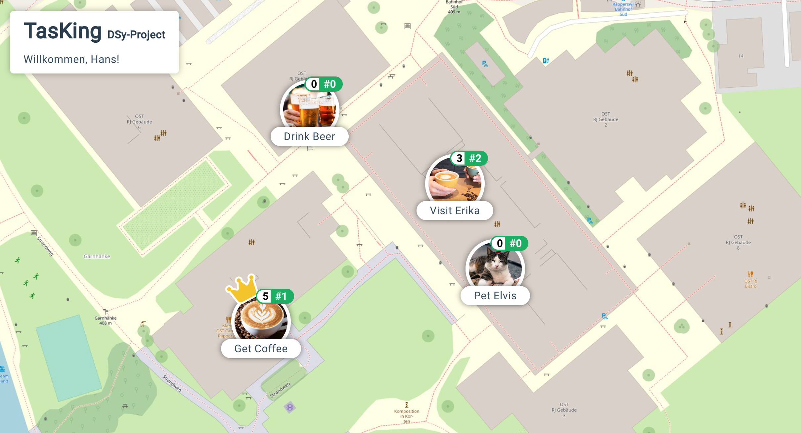

# Welcome to TasKing
This repository contains the source code of the TasKing application created as part of the challenge  task for the module Distributed Systems (DSy FS2023) at the Eastern Switzerland University of Applied Sciences.

TasKing is a simple application that allows users to complete tasks on the campus of Rapperswil-Jona. The person who has completed a task the most is nominated "TasKing", indicated by the presence of a crown above the task. As required by the assignment, the application consists of a frontend, a backend and a load balancer.



## Infrastructure
The following diagram explains the infrastructure of our application. Details about the different components (frontend, backend and load balancer) can be found in the sections below.


### Frontend
**Technologies:** HTML, TS, SCSS

The frontend consists of a single `index.html` that communicates with the backend using a Single Page Application (SPA) architecture.
Since no framework like Vue, React, etc. was used, all logic is located in the `scripts.ts` file, which retrieves and updates each task using an ugly (but for this challenge task sufficient) polling mechanism. 
Both the `scripts.ts` and `default-theme.scss` are compiled/transpiled using npm, both locally and within the Dockerfile.

### Backend
TODO: Insert Text

### Load Balancer
**Technologies:** Traefik

The load balancer has the open ports HTTP `80` and HTTPS `443`. The HTTP port will be redirected to HTTPS automatically. Because this runs only on one client and simplify reasons, an certificate is not implemented. Therefore, a certificate error will be displayed. A certificate could be implemented in the future.
The service which runs on the port `443` is with HTTP/3 configured. Afterwards the traffic will be forward to the frontend with the port `2022`.
The fronted gets the data by do request with the prefix `/api`, the load balancer routes all traffic with this prefix to the backend service. The backend service contains two backend containers, the service translates the traffic to the port `8080`.

The backend service includes a health check to determine if the backend containers still running and in the heathy state. If a container fails it takes up to 10s to route all traffic to the healthy one.

## Usage
### Running Locally
The application can be started using:

```
docker-compose up
```
After starting, the frontend will be available under `http://localhost/`. Please note that the docker compose command might run into issues if the default port (`80`) is already in use.

### Backend API
The following table gives insights into the different endpoints the backend provides.

| Description               | HTTP Method | Endpoint                        |
|---------------------------|-------------|---------------------------------|
| Return all task           | GET         | `/api/tasks`                    |
| Return task by id         | GET         | `/api/tasks/{task-id}`          |
| Return rankings of a task | GET         | `/api/tasks/{task-id}/rankings` |
| Return all task histories | GET         | `/api/history/{task-id}`        |
| Save a new task           | POST        | `/api/tasks`                    |
| Save a new history entry  | POST        | `/api/history`                  |

## Authors
Vina Zahnd, Vanessa Gyger, Lukas Messmer